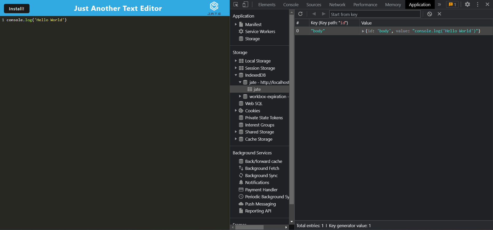
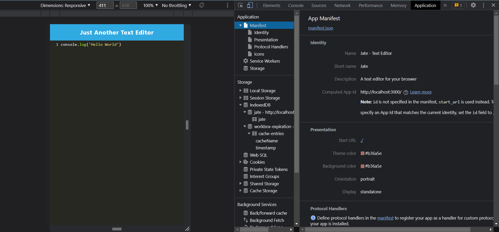
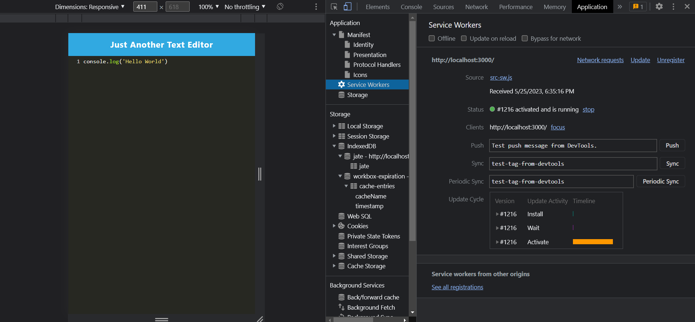

# Text-Editor
A text editor that runs in your browser.

To see the deployed app [click here](#).

## Table of Contents

[Description](#description)

[Installation](#Installation)

[Usage](#Usage)

[Screenshots](#screenshots)

[Technologies-Used](#technologies-used)

[Credits](#credits)

[Questions](#questions)

## Description

This text-editor app allows a user to type code into the editor and have their data saved if they leave the page. A user can also close the page completely and once they come back, their data will still be there.

## Installation

Click the 'install' button at the top of the application to install.

## Usage

Type in whatever you would like into the text editor. Your data will be cached and accessible even offline.

## Screenshots

## Technologies Used

* Node.js
* Webpack
* Babel
* IndexedDb

## Credits

Thank you to my classmates, instructors, and TAs!

## License

[Click here](https://opensource.org/licenses/MIT) for more information on the license used.

## Questions

[Click Here](https://github.com/emilymclean94) to view my GitHub profile.